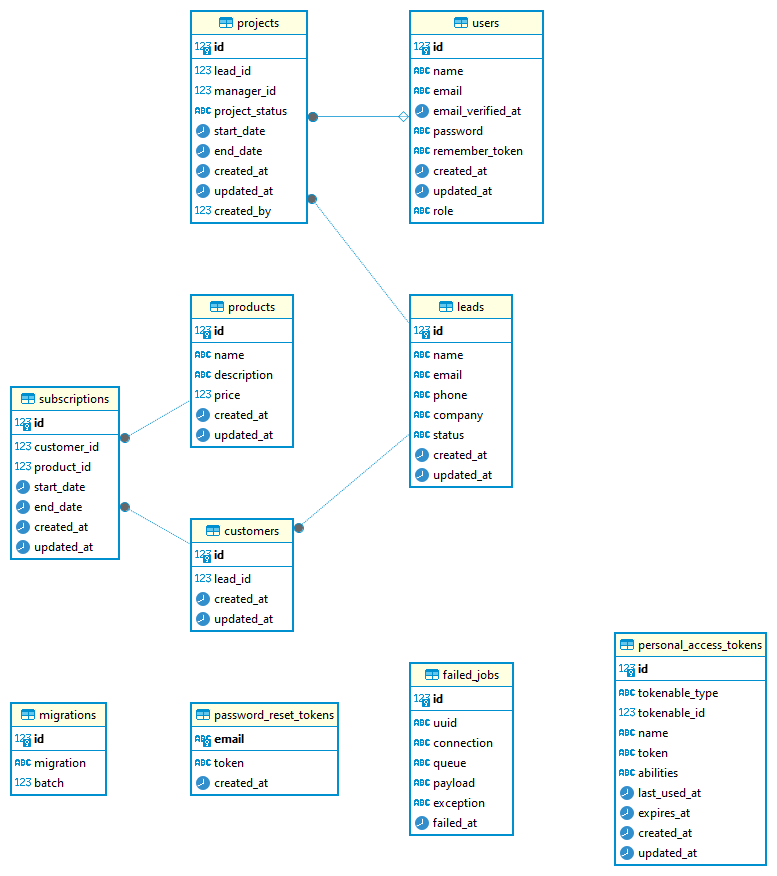

<!-- 

 -->

<h1>Aplikasi CRM Dio Surya Putra</h1>

## About

Aplikasi Customer Relationship Management (CRM) ini dirancang untuk membantu divisi sales PT. Smart dalam mengelola leads, proyek, pelanggan, produk, dan langganan. Aplikasi ini dibangun menggunakan Laravel dan mencakup berbagai fitur kunci untuk mempermudah operasi penjualan.

## User Role

<h3>1. Admin/SuperAdmin</h3>
<ul>
    <li><strong>Akses Penuh:</strong> Admin atau SuperAdmin memiliki hak akses penuh terhadap semua menu dan halaman dalam aplikasi.</li>
    <li><strong>Manajemen Data:</strong> Admin dapat menampilkan, mengelola, dan memodifikasi seluruh data yang ada di dalam sistem, tanpa batasan.</li>
</ul>

<h3>2. Manager</h3>
<ul>
    <li><strong>Akses Terbatas pada Proyek:</strong> Manager hanya dapat menampilkan data proyek yang terelasi atau ditugaskan kepada mereka melalui login masing-masing.</li>
    <li><strong>Persetujuan Proyek:</strong> Manager memiliki wewenang untuk melakukan persetujuan (approve) atau penolakan (reject) terhadap proyek yang berada dalam tanggung jawab mereka.</li>
    <li><strong>Manajemen Produk:</strong> Manager dapat menambah, mengedit, dan menghapus produk yang ditawarkan.</li>
    <li><strong>Manajemen Langganan:</strong> Manager dapat membuat, mengedit, dan menghapus data langganan (subscriptions).</li>
    <li><strong>Akses Menu Leads:</strong> Manager juga memiliki akses untuk melihat dan mengelola data calon pelanggan (leads).</li>
</ul>

<h3>3. Staff/Marketing/Admin Marketing dan Lainnya</h3>
<ul>
    <li><strong>Akses Produk:</strong> Staff memiliki akses untuk melihat data produk yang tersedia.</li>
    <li><strong>Manajemen Leads:</strong> Staff dapat menambah dan mengedit data calon pelanggan (leads).</li>
    <li><strong>Pembuatan Proyek:</strong> Staff juga memiliki kemampuan untuk membuat proyek baru berdasarkan leads yang dikelola.</li>
</ul>

## Fitur

1. Halaman Login
Tujuan: Menyediakan autentikasi bagi pengguna untuk mengakses aplikasi.
Detail: Pengguna dapat login dengan kredensial mereka. Peran pengguna menentukan level akses dalam aplikasi.

2. Manajemen Leads
Tujuan: Mengelola dan melihat calon pelanggan (leads).
Detail: Menampilkan daftar semua leads, melihat detail lead, dan melacak statusnya.

3. Master Produk (Layanan Internet)
Tujuan: Mengelola daftar produk (layanan internet) yang ditawarkan oleh PT. Smart.
Detail: Menambah, memperbarui, dan menghapus produk. Melihat detail produk dan mengelola tawaran layanan.

4. Manajemen Proyek
Tujuan: Memproses leads dan mengelola proyek dengan persetujuan dari manajer.
Detail: Membuat proyek baru berdasarkan leads, menetapkan manajer, dan melacak status proyek. Proyek memerlukan persetujuan manajer sebelum dapat dilanjutkan. Manajer dapat melihat dan menyetujui atau menolak proyek.

5. Manajemen Pelanggan
Tujuan: Mengelola pelanggan yang memiliki langganan aktif.
Detail: Menampilkan daftar pelanggan yang telah berlangganan, melihat detail langganan mereka, dan melacak layanan yang mereka gunakan.

## Skema Basis Data

Aplikasi ini menggunakan tabel basis data berikut:

1. users
id: Kunci Primer
name: Nama pengguna
email: Email pengguna
password: Password pengguna
role: ENUM('admin', 'manager', 'staff') - Peran pengguna

2. leads
id: Kunci Primer
name: Nama lead
contact_info: Informasi kontak lead
status: Status lead (misalnya, baru, dihubungi, dikonversi)

3. products
id: Kunci Primer
name: Nama produk
description: Deskripsi produk
price: Harga produk

4. projects
id: Kunci Primer
lead_id: Kunci Asing (mengacu ke leads.id)
manager_id: Kunci Asing (mengacu ke users.id)
status: Status proyek (misalnya, pending, approved, rejected)
created_by: ID pengguna yang membuat proyek
start_date: Tanggal mulai proyek
end_date: Tanggal akhir proyek

5. customers
id: Kunci Primer
name: Nama pelanggan
contact_info: Informasi kontak pelanggan

6. subscriptions
id: Kunci Primer
customer_id: Kunci Asing (mengacu ke customers.id)
product_id: Kunci Asing (mengacu ke products.id)
start_date: Tanggal mulai langganan
end_date: Tanggal akhir langganan

## Instalasi dan Setup

1. Clone Repository
 - git clone <repository-url>

2. Navigasi ke Direktori Proyek
 - cd project-directory

3. Instalasi Dependencies
 - composer install
 - npm install

4. Siapkan File Lingkungan
 - cp .env.example .env

5. Generate Application Key
 - php artisan key:generate

6. Jalankan Migrasi
 - php artisan migrate

7. Jalankan Aplikasi
 - php artisan serve

### Penggunaan

- Login: Akses halaman login dan masukkan kredensial Anda untuk login.
- Manajemen Leads: Akses halaman leads untuk melihat dan mengelola calon pelanggan.
- Manajemen Produk: Akses halaman master produk untuk mengelola layanan internet.
- Buat Proyek: Buat dan kelola proyek berdasarkan leads. Manajer akan meninjau dan menyetujui/menolak proyek.
- Lihat Pelanggan: Akses halaman pelanggan untuk melihat pelanggan yang telah berlangganan dan layanan yang mereka gunakan.

## DRD

